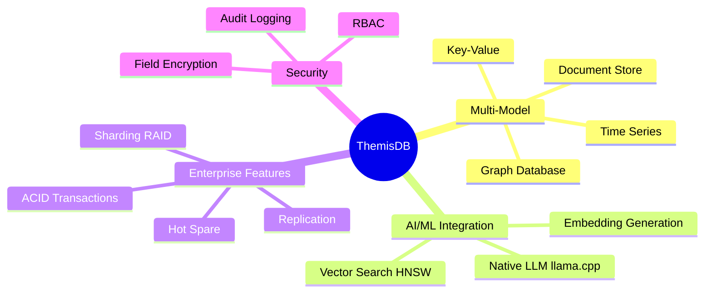
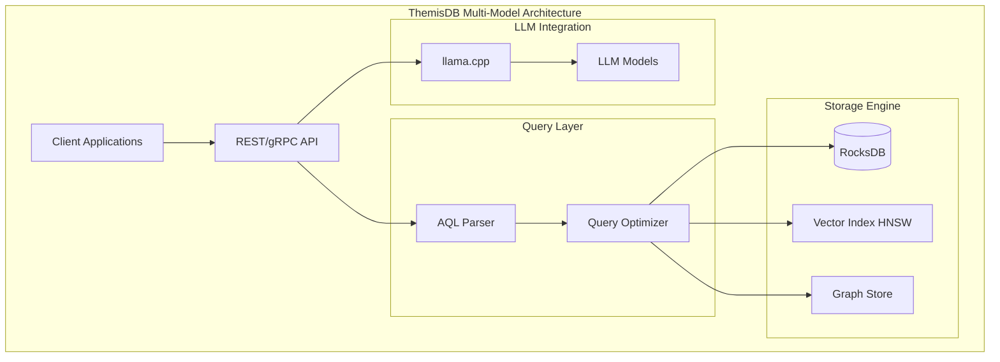
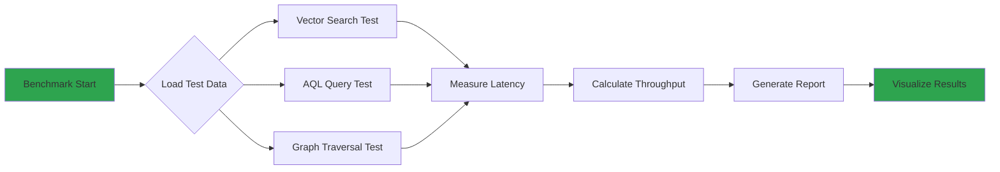
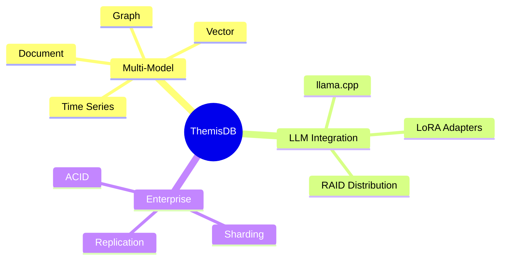
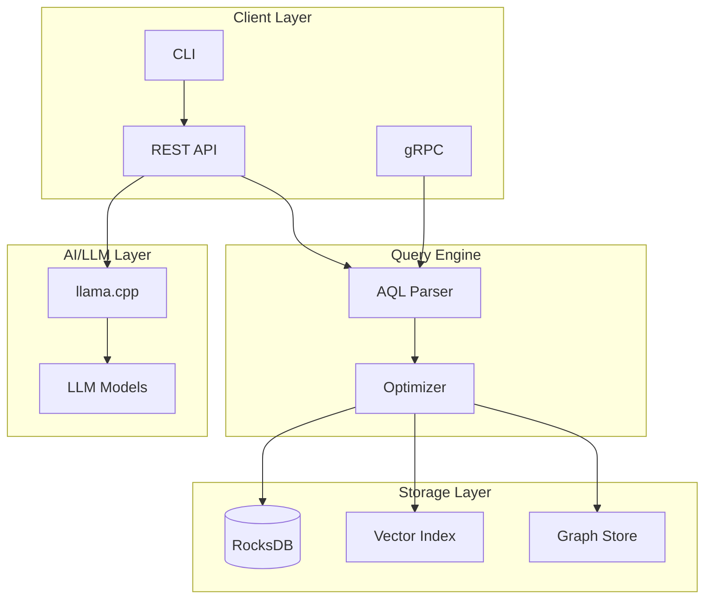
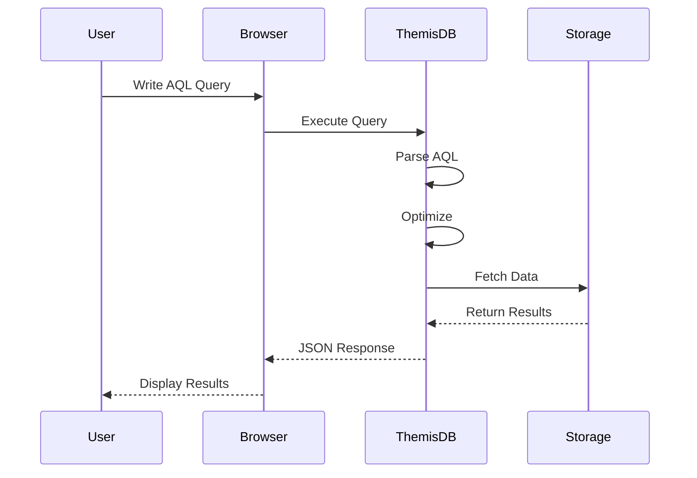

# ThemisDB-spezifische WordPress Plugins - Konzept und Empfehlungen

**Version:** 1.0.0  
**Datum:** Januar 2026  
**Status:** Konzept/Planung  
**Zielgruppe:** Entwickler, Marketing-Team, Produktmanagement

---

## Executive Summary

Dieses Dokument beschreibt spezialisierte WordPress-Plugins für die ThemisDB-Website, die **ThemisDB-spezifische Daten und Erkenntnisse** visualisieren und interaktiv präsentieren. Ähnlich dem bereits entwickelten **TCO Calculator**, zielen diese Plugins darauf ab, Benchmark-Ergebnisse, Feature-Vergleiche, Test-Reports und Dokumentations-Insights dynamisch darzustellen.

### Unterschied zu generischen Plugins

| Typ | Zweck | Beispiel |
|-----|-------|----------|
| **Generische Plugins** | WordPress-Website-Funktionalität | Rank Math SEO, Wordfence Security |
| **ThemisDB-spezifische Plugins** | ThemisDB-Daten visualisieren | TCO Calculator, Benchmark Visualizer |

**Dieses Dokument fokussiert sich auf ThemisDB-spezifische Plugins.**

---

## 1. Bereits existierender Plugin: TCO Calculator ✅

### ThemisDB TCO Calculator
**Status:** ✅ Bereits entwickelt und produktionsreif  
**Pfad:** `/tools/tco-calculator-wordpress/`

**Funktionen:**
- Interaktiver Kostenrechner für ThemisDB vs. Wettbewerber
- Berechnung von Infrastruktur-, Personal-, Lizenz- und Betriebskosten
- Dynamische Visualisierungen mit Chart.js
- Export-Funktionen (PDF, CSV)
- WordPress-Shortcode: `[themisdb_tco_calculator]`

**Verwendung als Design-Template für Phase 1:** ⭐
Dieser Plugin dient als **verbindliche Referenz-Implementierung** für Benchmark Visualizer und Feature Matrix.

### TCO Calculator - Technische Struktur (als Vorlage)

**Dateistruktur:**
```
tco-calculator-wordpress/
├── themisdb-tco-calculator.php    # Haupt-Plugin mit WordPress-Hooks
├── assets/
│   ├── css/
│   │   └── tco-calculator.css     # Styling (wiederverwenden!)
│   └── js/
│       └── tco-calculator.js      # JavaScript-Logik mit Chart.js
└── templates/
    ├── calculator.php             # HTML-Template
    └── admin-settings.php         # Admin-Einstellungsseite
```

**Design-Prinzipien vom TCO Calculator:**
1. **Clean & Modern UI:** Minimalistisches Design mit klaren Farben
2. **Responsive Layout:** Mobile-First Approach
3. **Chart.js Integration:** Konsistente Visualisierungen
4. **Interactive Elements:** Slider, Dropdowns, Radio-Buttons
5. **Export-Funktionen:** PDF, CSV Download-Buttons

**CSS-Klassen zum Wiederverwenden:**
```css
.themisdb-calculator-wrapper    /* Haupt-Container */
.themisdb-section              /* Abschnitte */
.themisdb-chart-container      /* Chart-Bereiche */
.themisdb-btn-primary          /* Primäre Buttons */
.themisdb-input-group          /* Input-Felder */
.themisdb-results              /* Ergebnis-Darstellung */
```

**JavaScript-Pattern:**
```javascript
// TCO Calculator Pattern für neue Plugins
window.ThemisDBPlugin = {
    init: function() { /* Initialisierung */ },
    loadData: function() { /* Daten laden */ },
    renderChart: function() { /* Chart.js */ },
    exportPDF: function() { /* Export */ }
};
```

**WordPress-Integration (aus TCO Calculator übernehmen):**
```php
// Shortcode-Registrierung
add_shortcode('themisdb_benchmark_visualizer', 'themisdb_bv_shortcode');

// Assets nur bei Shortcode laden
add_action('wp_enqueue_scripts', function() {
    if (has_shortcode(get_post()->post_content, 'themisdb_benchmark_visualizer')) {
        wp_enqueue_style('themisdb-bv-style');
        wp_enqueue_script('themisdb-bv-script');
    }
});

// Admin-Seite
add_action('admin_menu', function() {
    add_options_page('Benchmark Visualizer', 'Benchmark Visualizer', 
                     'manage_options', 'themisdb-bv', 'themisdb_bv_admin_page');
});
```

---

## 2. Vorgeschlagene ThemisDB-spezifische WordPress Plugins

### 2.1 Benchmark Visualizer Plugin 🎯 **Priorität: Hoch**

**Zweck:** Interaktive Visualisierung von ThemisDB Performance-Benchmarks

**Features:**
- Live-Daten aus Benchmark-Ergebnissen (JSON/API)
- Vergleichbare Charts: ThemisDB vs. PostgreSQL vs. MongoDB vs. Neo4j
- Filterfunktionen:
  - Nach Operation (Vector Search, AQL Query, Graph Traversal)
  - Nach Metrik (Throughput, Latency, Memory)
  - Nach Version (v1.3.x, v1.4.x)
- Interaktive Grafiken mit Chart.js/D3.js
- Export-Funktionen

**Datenquelle:**
```yaml
Source: /benchmarks/benchmark_results/
Format: JSON, CSV
Update: Automatisch bei neuen Releases
```

**Shortcode-Beispiele:**
```php
// Alle Benchmarks anzeigen
[themisdb_benchmark_visualizer]

// Nur Vector Search Benchmarks
[themisdb_benchmark_visualizer category="vector_search"]

// Vergleich mit spezifischen Datenbanken
[themisdb_benchmark_visualizer compare="postgresql,mongodb"]

// Latenz-Vergleich
[themisdb_benchmark_visualizer metric="latency" chart_type="bar"]
```

**Technische Umsetzung (basierend auf TCO Calculator):**

**1. Plugin-Struktur (analog zu TCO Calculator):**
```
themisdb-benchmark-visualizer/
├── themisdb-benchmark-visualizer.php    # Analog zu themisdb-tco-calculator.php
├── assets/
│   ├── css/
│   │   └── benchmark-visualizer.css     # Importiert tco-calculator.css Basis-Styles
│   └── js/
│       └── benchmark-visualizer.js      # Gleiche Chart.js Pattern wie TCO Calculator
└── templates/
    ├── visualizer.php                   # Analog zu calculator.php
    └── admin-settings.php               # Gleiche Struktur wie TCO Calculator
```

**2. JavaScript API (Pattern vom TCO Calculator):**
```javascript
// Analog zu window.tcoCalculator im TCO Calculator
window.ThemisDBBenchmarks = {
  init: function() {
    this.loadData();
    this.setupFilters();
    this.renderInitialChart();
  },
  loadData: async (version) => { 
    // Benchmark-Daten laden (ähnlich TCO Calculator Daten-Handling)
  },
  renderChart: (container, data, options) => { 
    // Chart.js (gleiche Library-Version wie TCO Calculator)
    // Wiederverwendung der Chart-Konfiguration
  },
  exportCSV: (data) => { 
    // CSV Export (gleiche Logik wie TCO Calculator)
  },
  exportPDF: () => {
    // PDF Export (gleiche Library wie TCO Calculator)
  }
};
```

**3. CSS-Styling (TCO Calculator als Basis):**
```css
/* Importiere TCO Calculator Basis-Styles */
@import 'tco-calculator.css';

/* Benchmark-spezifische Erweiterungen */
.themisdb-benchmark-container {
  /* Verwende gleiche Spacing/Colors wie TCO Calculator */
}

.themisdb-benchmark-chart {
  /* Analog zu .themisdb-tco-chart */
}
```

**Admin-Einstellungen (analog zu TCO Calculator):**
- Benchmark-Datenquelle (JSON-URL oder lokale Datei)
- Standard-Vergleichsdatenbanken
- Chart-Theme (Dark/Light) - gleiche Themes wie TCO Calculator
- Auto-Update Intervall

**Implementierungsaufwand:** ~40-60h (reduziert durch TCO Calculator Wiederverwendung)  
**ROI:** Zeigt Performance-Vorteile direkt auf der Website

---

### 2.2 Feature Matrix Plugin 🎯 **Priorität: Mittel**

**Zweck:** Interaktive Feature-Vergleichsmatrix ThemisDB vs. Wettbewerber

**Features:**
- Dynamische Feature-Tabelle mit Filterfunktionen
- Kategorien: Multi-Model, LLM, Security, Performance, Deployment
- Feature-Status: ✅ Verfügbar, ⚠️ Beta, 🔧 Geplant, ❌ Nicht verfügbar
- Detaillierte Feature-Beschreibungen (Tooltips/Modals)
- Vergleich: ThemisDB vs. ausgewählte Datenbanken

**Datenquelle:**
```yaml
Source: /docs/features/feature_matrix.json
Structure:
  features:
    - name: "Native LLM Integration"
      category: "AI/ML"
      themisdb: "available"
      postgresql: "external_only"
      mongodb: "external_only"
      description: "Run LLaMA models directly in database"
```

**Shortcode-Beispiele:**
```php
// Vollständige Matrix
[themisdb_feature_matrix]

// Nur AI/ML Features
[themisdb_feature_matrix category="ai_ml"]

// Vergleich mit spezifischen DBs
[themisdb_feature_matrix compare="postgresql,mongodb,neo4j"]

// Kompakte Ansicht
[themisdb_feature_matrix view="compact"]
```

**UI-Konzept (inspiriert von TCO Calculator Layout):**
```
┌────────────────────────────────────────────────────────────┐
│ Feature                    │ ThemisDB │ PostgreSQL │ MongoDB│
├────────────────────────────┼──────────┼────────────┼────────┤
│ ✅ Multi-Model Support     │    ✅    │     ❌     │   ⚠️   │
│ ✅ Native LLM Integration  │    ✅    │     ❌     │   ❌   │
│ ✅ Vector Search (HNSW)    │    ✅    │  pgvector  │ Atlas  │
│ ✅ Graph Database          │    ✅    │   Age      │   ❌   │
│ ✅ Document Store          │    ✅    │   JSONB    │   ✅   │
│ ✅ Time Series             │    ✅    │ TimescaleDB│   ❌   │
└────────────────────────────────────────────────────────────┘
[Filter: 🎯 All | 🤖 AI/ML | 📊 Performance | 🔒 Security]
```

**Technische Umsetzung (basierend auf TCO Calculator):**

**1. Plugin-Struktur (analog zu TCO Calculator):**
```
themisdb-feature-matrix/
├── themisdb-feature-matrix.php          # Analog zu themisdb-tco-calculator.php
├── assets/
│   ├── css/
│   │   └── feature-matrix.css           # Basis-Styles vom TCO Calculator
│   └── js/
│       └── feature-matrix.js            # Interaktive Tabelle mit jQuery/Vanilla JS
└── templates/
    ├── matrix.php                       # HTML-Template mit TCO Calculator CSS-Klassen
    └── admin-settings.php               # Admin-Panel wie TCO Calculator
```

**2. JavaScript (Pattern vom TCO Calculator):**
```javascript
// Analog zu window.tcoCalculator
window.ThemisDBFeatureMatrix = {
  init: function() {
    this.loadFeatures();
    this.setupFilters();
    this.renderTable();
    this.renderMermaidDiagram(); // Optional: Mermaid Visualisierung
  },
  loadFeatures: async () => {
    // Feature-Daten laden (ähnlich TCO Calculator)
  },
  renderTable: (filters) => {
    // Dynamische Tabelle mit Sortierung/Filterung
  },
  renderMermaidDiagram: () => {
    // Optional: Feature-Beziehungen als Mermaid-Diagramm
    const mermaidCode = `
      graph LR
        ThemisDB[ThemisDB Features]
        ThemisDB --> MultiModel[Multi-Model Support ✅]
        ThemisDB --> LLM[Native LLM ✅]
        ThemisDB --> Vector[Vector Search ✅]
        ThemisDB --> Graph[Graph DB ✅]
        
        style ThemisDB fill:#2ea44f
        style MultiModel fill:#2ea44f
        style LLM fill:#2ea44f
    `;
    mermaid.render('feature-diagram', mermaidCode);
  },
  exportPDF: () => {
    // PDF Export (gleiche Mechanik wie TCO Calculator)
  }
};
```

**Alternative Visualisierung mit Mermaid.js:**


**3. CSS-Styling (TCO Calculator wiederverwenden):**
```css
/* Gleiche Container-Klassen wie TCO Calculator */
.themisdb-feature-wrapper {
  /* Analog zu .themisdb-calculator-wrapper */
}

.themisdb-feature-table {
  /* Tabellen-Styling konsistent mit TCO Calculator Cards */
}

/* Filter-Buttons wie im TCO Calculator */
.themisdb-filter-btn {
  /* Gleiche Button-Styles */
}

/* Mermaid-Diagramm Container */
.themisdb-mermaid-container {
  margin: 2rem 0;
  text-align: center;
}
```

**Implementierungsaufwand:** ~30-40h (reduziert durch TCO Calculator + Mermaid.js)  
**ROI:** Hebt Alleinstellungsmerkmale hervor

---

### 2.3 Test Coverage Dashboard 🎯 **Priorität: Niedrig**

**Zweck:** Visualisierung der Test-Abdeckung und Qualitätsmetriken

**Features:**
- Test Coverage Statistiken
- Erfolgsrate der CI/CD-Pipelines
- Code Quality Metrics (CodeQL, Cppcheck)
- Historische Trends

**Datenquelle:**
```yaml
Source: GitHub Actions API + Test Reports
Metrics:
  - Test Coverage %
  - Passing Tests Count
  - Failed Tests Count
  - Code Quality Score
```

**Shortcode:**
```php
[themisdb_test_dashboard]
[themisdb_test_dashboard metric="coverage"]
[themisdb_test_dashboard period="last_30_days"]
```

**Implementierungsaufwand:** ~20-30h
**ROI:** Zeigt Qualitäts-Commitment

---

### 2.4 Documentation Search Plugin 🎯 **Priorität: Mittel**

**Zweck:** Intelligente Suche in ThemisDB-Dokumentation mit AI

**Features:**
- Semantische Suche über gesamte Dokumentation
- Code-Beispiel-Suche
- Kategorie-Filter (AQL, API, Deployment, LLM)
- "Did you mean...?" Vorschläge
- Popularität-basierte Rankings

**Datenquelle:**
```yaml
Source: /docs/**/*.md
Index: Vector embeddings der Dokumentation
Backend: ThemisDB Vector Search (Hundeführung!)
```

**Shortcode:**
```php
[themisdb_docs_search]
[themisdb_docs_search placeholder="Search AQL syntax..."]
[themisdb_docs_search categories="aql,api"]
```

**Besonderheit:**
- Nutzt **ThemisDB selbst** als Search Backend!
- Demonstriert Vector Search Capabilities
- Kann mit eigenem LLM intelligente Antworten generieren

**Implementierungsaufwand:** ~50-70h (mit ThemisDB Backend)
**ROI:** Showcases ThemisDB Capabilities live!

---

### 2.5 Live Query Playground 🎯 **Priorität: Hoch**

**Zweck:** Interaktiver AQL Query Playground in der Browser

**Features:**
- Code-Editor mit Syntax-Highlighting (AQL)
- Live-Ausführung gegen Demo-Datenbank
- Vorgeladene Beispiel-Queries
- Ergebnis-Visualisierung (Table, JSON, Graph)
- Query-Performance-Metriken
- Share-Funktion für Queries

**Technische Architektur:**
```yaml
Frontend: CodeMirror/Monaco Editor
Backend: ThemisDB Read-Only Instance (Docker)
Security: Rate-Limiting, Sandboxing
Demo Data: Vorgenerierte Beispieldaten
```

**Shortcode:**
```php
[themisdb_query_playground]
[themisdb_query_playground example="vector_search"]
[themisdb_query_playground readonly="true"]
```

**Beispiel-UI:**
```
┌────────────────────────────────────────────────────────────┐
│ AQL Query Editor                                    [Run ▶]│
├────────────────────────────────────────────────────────────┤
│ 1  SELECT * FROM users                                     │
│ 2  WHERE age > 25                                          │
│ 3  ORDER BY name                                           │
│ 4  LIMIT 10                                                │
├────────────────────────────────────────────────────────────┤
│ Results (10 rows in 2.3ms)                                 │
├────────────────────────────────────────────────────────────┤
│ │ id │ name        │ age │                                 │
│ │ 1  │ Alice Smith │ 28  │                                 │
│ │ 2  │ Bob Jones   │ 31  │                                 │
│ ...                                                        │
└────────────────────────────────────────────────────────────┘
[Examples: Vector Search | Graph Traversal | Joins | LLM]
```

**Implementierungsaufwand:** ~80-100h
**ROI:** Extrem hoher Wert - User können ThemisDB direkt testen!

---

### 2.6 Release Timeline Visualizer 🎯 **Priorität: Niedrig**

**Zweck:** Interaktive Timeline der ThemisDB Releases und Features

**Features:**
- Chronologische Release-Darstellung
- Feature-Highlights pro Version
- Breaking Changes Warnings
- Migration Guides Links
- Filter nach Major/Minor/Patch

**Datenquelle:**
```yaml
Source: CHANGELOG.md, GitHub Releases API
Format: Parsed Markdown + Metadata
```

**Shortcode:**
```php
[themisdb_release_timeline]
[themisdb_release_timeline version="major_only"]
[themisdb_release_timeline from="v1.0.0" to="v1.4.0"]
```

**Implementierungsaufwand:** ~25-35h
**ROI:** Übersichtliche Produktentwicklung

---

### 2.7 Architecture Diagram Interactive 🎯 **Priorität: Mittel**

**Zweck:** Interaktive ThemisDB-Architektur-Diagramme

**Features:**
- Klickbare Architektur-Komponenten
- Detail-Popup bei Klick auf Komponente
- Mehrere Ansichten:
  - High-Level (Multi-Model Architecture)
  - Storage Layer (RocksDB, Indexes)
  - LLM Integration (llama.cpp)
  - Sharding/RAID Architecture
- Export als SVG/PNG
- Live-Rendering mit Mermaid.js

**Technologie:** ⭐ **Mermaid.js empfohlen**
```yaml
Frontend: Mermaid.js (Primary) oder D3.js
Backend: Mermaid-Syntax aus Markdown/JSON
Interactive: JavaScript Events + Mermaid API
Benefits:
  - Einfache Syntax (Text-basierte Diagramme)
  - Wartbar (Diagramme als Code)
  - Versionierbar (Git-freundlich)
  - Kein manuelles SVG-Editing
```

**Mermaid.js Beispiel:**


**Shortcode:**
```php
[themisdb_architecture view="high_level"]
[themisdb_architecture view="storage_layer"]
[themisdb_architecture view="llm_integration"]
[themisdb_architecture interactive="true" theme="dark"]
```

**Implementation mit Mermaid.js:**
```javascript
// Mermaid-Integration im Plugin
window.ThemisDBArchitecture = {
  init: function() {
    mermaid.initialize({ 
      startOnLoad: true,
      theme: 'neutral',
      flowchart: { useMaxWidth: true }
    });
  },
  renderDiagram: function(view) {
    const mermaidCode = this.getDiagramCode(view);
    mermaid.render('architecture-diagram', mermaidCode);
  },
  addInteractivity: function() {
    // Click-Events auf Mermaid-Elemente
    document.querySelectorAll('.node').forEach(node => {
      node.addEventListener('click', this.showDetails);
    });
  }
};
```

**Vorteile Mermaid.js:**
- ✅ Text-basiert → einfach zu aktualisieren
- ✅ Versionierung in Git möglich
- ✅ Automatisches Layout
- ✅ Konsistente Darstellung
- ✅ Interaktive Links möglich
- ✅ Export als SVG/PNG integriert

**Implementierungsaufwand:** ~35-45h (reduziert durch Mermaid.js)  
**ROI:** Visualisiert Komplexität verständlich

---

## 3. Priorisierung und Roadmap

### Phase 1: Quick Wins (Q1 2026) ⭐ **START HIER**

**Design-Template:** Nutze `/tools/tco-calculator-wordpress/` als Vorlage für Design, Code-Struktur und Best Practices.

```yaml
1. Benchmark Visualizer (Prio: Hoch)
   - Aufwand: 40-60h
   - Impact: Zeigt Performance-Vorteile
   - Dependencies: Benchmark-Daten strukturieren
   - Design: Basiert auf TCO Calculator UI/UX
   
2. Feature Matrix (Prio: Mittel)
   - Aufwand: 30-40h
   - Impact: Hebt USPs hervor
   - Dependencies: Feature-Matrix-JSON erstellen
   - Design: Basiert auf TCO Calculator UI/UX
```

**Phase 1 Implementation Guidelines:**
- ✅ **Code-Struktur:** Gleiche Plugin-Architektur wie TCO Calculator
- ✅ **Design-System:** Verwende TCO Calculator CSS-Klassen und Styling
- ✅ **Chart.js Version:** Gleiche Library-Versionen wie TCO Calculator (für Charts)
- ✅ **Mermaid.js:** Für Diagramme und Architektur-Visualisierungen (zusätzlich)
- ✅ **Admin-Panel:** Analog zu TCO Calculator Settings-Page
- ✅ **Shortcode-Pattern:** Gleiche Parameter-Logik wie `[themisdb_tco_calculator]`
- ✅ **Export-Funktionen:** PDF/CSV wie im TCO Calculator

**Technologie-Stack für Phase 1:**
```yaml
Visualisierung:
  Chart.js: Performance-Charts, Metriken (vom TCO Calculator)
  Mermaid.js: Architektur-Diagramme, Flowcharts, Entity-Relationships
  
Mermaid.js Einsatzbereiche:
  - Benchmark Visualizer: Workflow-Diagramme für Test-Pipelines
  - Feature Matrix: Mind-Maps und Beziehungs-Diagramme
  - Architecture Diagrams: System-Architektur (Phase 2)
  
Vorteile Mermaid.js:
  - Text-basierte Diagramme (wartbar, versionierbar)
  - Automatisches Layout
  - Integration mit Markdown-Dokumentation
  - Export als SVG/PNG
  - Interaktive Klicks möglich
```

**Vorteile:**
- Konsistentes Look & Feel über alle ThemisDB-Plugins
- Weniger Entwicklungsaufwand durch Code-Wiederverwendung
- Bewährte UX-Patterns vom TCO Calculator übernehmen
- Flexible Visualisierung mit Chart.js + Mermaid.js

---

### Phase 2: High-Value Features (Q2 2026)
```yaml
3. Live Query Playground (Prio: Hoch)
   - Aufwand: 80-100h
   - Impact: Extrem hoch - Try-before-buy
   - Dependencies: Demo ThemisDB Instance
   - Visualisierung: Mermaid.js für Query-Execution-Plans

4. Architecture Diagrams (Prio: Mittel)
   - Aufwand: 35-45h (reduziert durch Mermaid.js)
   - Impact: Visualisiert Komplexität verständlich
   - Dependencies: Architektur-Diagramme als Mermaid-Code
   - Technologie: Primär Mermaid.js
```

### Phase 3: Nice-to-Haves (Q3 2026)
```yaml
5. Documentation Search (Prio: Mittel)
   - Aufwand: 50-70h
   - Impact: Showcases Vector Search
   - Dependencies: Docs-Indexierung
   
6. Release Timeline (Prio: Niedrig)
   - Aufwand: 25-35h

7. Test Dashboard (Prio: Niedrig)
   - Aufwand: 20-30h
```

---

## 4. Technische Implementierungs-Guidelines

### 4.1 Plugin-Architektur (basierend auf TCO Calculator)

**Verzeichnisstruktur:**
```
themisdb-<plugin-name>/
├── themisdb-<plugin-name>.php    # Haupt-Plugin-Datei
├── README.md                     # Dokumentation
├── LICENSE                       # MIT Lizenz
├── assets/
│   ├── css/
│   │   └── <plugin-name>.css
│   ├── js/
│   │   └── <plugin-name>.js
│   └── images/
└── templates/
    ├── <plugin-name>.php         # HTML-Template
    └── admin-settings.php        # Admin-Panel
```

**Plugin-Header (Beispiel):**
```php
/**
 * Plugin Name: ThemisDB Benchmark Visualizer
 * Plugin URI: https://github.com/makr-code/ThemisDB
 * Description: Interactive visualization of ThemisDB performance benchmarks
 * Version: 1.0.0
 * Author: ThemisDB Team
 * Author URI: https://github.com/makr-code
 * License: MIT
 * Text Domain: themisdb-benchmark-visualizer
 */
```

### 4.2 Mermaid.js Integration ⭐ **Neu empfohlen**

**Warum Mermaid.js:**
- Text-basierte Diagramme (einfach zu warten und versionieren)
- Automatisches Layout (kein manuelles Positioning)
- Viele Diagramm-Typen: Flowchart, Sequence, Class, Entity-Relationship, Mind-Map
- WordPress-freundlich (einfache Integration)
- Export als SVG/PNG integriert

**Installation in WordPress-Plugin:**
```php
// In Plugin-Haupt-Datei
function themisdb_plugin_enqueue_scripts() {
    // Mermaid.js von CDN laden
    wp_enqueue_script(
        'mermaid-js',
        'https://cdn.jsdelivr.net/npm/mermaid@10/dist/mermaid.min.js',
        array(),
        '10.0.0',
        true
    );
    
    // Plugin-spezifisches JavaScript
    wp_enqueue_script(
        'themisdb-plugin-js',
        plugin_dir_url(__FILE__) . 'assets/js/plugin.js',
        array('mermaid-js'),
        '1.0.0',
        true
    );
}
add_action('wp_enqueue_scripts', 'themisdb_plugin_enqueue_scripts');
```

**JavaScript-Initialisierung:**
```javascript
// Im Plugin JavaScript
document.addEventListener('DOMContentLoaded', function() {
    // Mermaid konfigurieren
    mermaid.initialize({
        startOnLoad: true,
        theme: 'neutral',
        securityLevel: 'loose', // Für interaktive Links
        flowchart: {
            useMaxWidth: true,
            htmlLabels: true,
            curve: 'basis'
        }
    });
    
    // Optional: Manuelles Rendering
    mermaid.run({
        querySelector: '.themisdb-mermaid-diagram'
    });
});
```

**Mermaid-Code in WordPress einbetten:**
```php
// Template-Datei
<div class="themisdb-mermaid-container">
    <div class="mermaid">
        <?php echo esc_html($mermaid_code); ?>
    </div>
</div>
```

**Beispiel-Diagramme für ThemisDB-Plugins:**

**1. Benchmark-Pipeline (Benchmark Visualizer):**


**2. Feature-Hierarchie (Feature Matrix):**


**3. Architektur-Diagramm (Architecture Diagrams):**


**4. Query Execution Plan (Live Query Playground):**


**Interaktive Features:**
```javascript
// Click-Events auf Mermaid-Elemente
window.addMermaidInteractivity = function() {
    document.querySelectorAll('.mermaid svg .node').forEach(node => {
        node.style.cursor = 'pointer';
        node.addEventListener('click', function(e) {
            const nodeId = this.id;
            showDetailModal(nodeId);
        });
    });
};

// Nach Mermaid-Rendering ausführen
mermaid.run().then(() => {
    addMermaidInteractivity();
});
```

**Export-Funktionen:**
```javascript
// SVG Export
function exportMermaidAsSVG() {
    const svg = document.querySelector('.mermaid svg');
    const svgData = new XMLSerializer().serializeToString(svg);
    const blob = new Blob([svgData], {type: 'image/svg+xml'});
    const url = URL.createObjectURL(blob);
    
    const a = document.createElement('a');
    a.href = url;
    a.download = 'themisdb-diagram.svg';
    a.click();
}

// PNG Export (via Canvas)
function exportMermaidAsPNG() {
    const svg = document.querySelector('.mermaid svg');
    const canvas = document.createElement('canvas');
    const ctx = canvas.getContext('2d');
    
    // SVG zu PNG konvertieren
    const img = new Image();
    img.onload = function() {
        canvas.width = img.width;
        canvas.height = img.height;
        ctx.drawImage(img, 0, 0);
        canvas.toBlob(blob => {
            const url = URL.createObjectURL(blob);
            const a = document.createElement('a');
            a.href = url;
            a.download = 'themisdb-diagram.png';
            a.click();
        });
    };
    img.src = 'data:image/svg+xml;base64,' + btoa(new XMLSerializer().serializeToString(svg));
}
```

**CSS-Styling für Mermaid:**
```css
/* Mermaid-Container im ThemisDB-Design */
.themisdb-mermaid-container {
    margin: 2rem 0;
    padding: 2rem;
    background: #f6f8fa;
    border-radius: 8px;
    overflow-x: auto;
}

.themisdb-mermaid-container .mermaid {
    text-align: center;
}

.themisdb-mermaid-container svg {
    max-width: 100%;
    height: auto;
}

/* Dark Mode Support */
.dark-mode .themisdb-mermaid-container {
    background: #1a1a1a;
}
```

---

### 4.3 Datenanbindung

**Option 1: Statische JSON-Dateien**
```php
// In Plugin
$benchmark_data = file_get_contents(
    plugin_dir_path(__FILE__) . 'data/benchmarks.json'
);
```

**Option 2: GitHub API (Live-Daten)**
```php
// Abrufen von GitHub
$url = 'https://api.github.com/repos/makr-code/ThemisDB/contents/benchmarks/results.json';
$response = wp_remote_get($url);
$data = json_decode(wp_remote_retrieve_body($response));
```

**Option 3: ThemisDB API (für Live Query Playground)**
```php
// Verbindung zu Demo-Instanz
$themisdb_host = get_option('themisdb_demo_host', 'demo.themisdb.com');
$client = new ThemisDBClient($themisdb_host);
$result = $client->query($aql_query);
```

**Option 4: Mermaid-Code aus Datei laden**
```php
// Für Architecture Diagrams
$mermaid_file = plugin_dir_path(__FILE__) . 'diagrams/architecture.mmd';
$mermaid_code = file_get_contents($mermaid_file);
echo '<div class="mermaid">' . esc_html($mermaid_code) . '</div>';
```

---

### 4.4 Sicherheit

**Wichtige Maßnahmen:**
```php
// 1. Nonce-Verification für alle AJAX-Requests
wp_verify_nonce($_POST['nonce'], 'themisdb_plugin_action');

// 2. Capability Checks
if (!current_user_can('manage_options')) {
    wp_die('Unauthorized');
}

// 3. Input Sanitization
$user_input = sanitize_text_field($_POST['input']);

// 4. Output Escaping
echo esc_html($output);

// 5. Rate Limiting (für Query Playground)
$rate_limit = new RateLimiter(60, 10); // 10 requests per minute
if (!$rate_limit->check($user_ip)) {
    wp_die('Rate limit exceeded');
}
```

### 4.4 Performance-Optimierung

**Best Practices:**
```php
// 1. Caching
$cache_key = 'themisdb_benchmarks_' . $version;
$data = wp_cache_get($cache_key);
if ($data === false) {
    $data = fetch_benchmark_data($version);
    wp_cache_set($cache_key, $data, '', 3600); // 1 Stunde
}

// 2. Lazy Loading
// Nur Assets laden wenn Shortcode auf Seite vorhanden
add_action('wp_enqueue_scripts', function() {
    global $post;
    if (has_shortcode($post->post_content, 'themisdb_benchmark_visualizer')) {
        wp_enqueue_script('themisdb-benchmark-js');
    }
});

// 3. Minification
// CSS/JS minifiziert ausliefern

// 4. CDN für Libraries
wp_enqueue_script('chartjs', 'https://cdn.jsdelivr.net/npm/chart.js@4.4.0');
```

---

## 5. Entwicklungs-Checkliste

### Für jedes neue Plugin:

**Phase 1: Planning**
- [ ] Plugin-Konzept definieren
- [ ] Datenquellen identifizieren
- [ ] UI-Mockups erstellen
- [ ] Technische Architektur planen

**Phase 2: Development**
- [ ] Grundgerüst erstellen (basierend auf TCO Calculator)
- [ ] Datenanbindung implementieren
- [ ] Frontend-UI entwickeln
- [ ] JavaScript-Interaktivität
- [ ] Admin-Panel erstellen
- [ ] Shortcode-Parameter testen

**Phase 3: Testing**
- [ ] Cross-Browser-Tests
- [ ] Mobile Responsiveness
- [ ] Performance-Tests
- [ ] Security-Audit
- [ ] User Acceptance Testing

**Phase 4: Documentation**
- [ ] README.md
- [ ] INSTALLATION.md
- [ ] USAGE.md mit Shortcode-Beispielen
- [ ] CHANGELOG.md

**Phase 5: Deployment**
- [ ] WordPress.org Plugin Directory (optional)
- [ ] GitHub Release
- [ ] Website-Integration
- [ ] Marketing-Ankündigung

---

## 6. Budget und Ressourcen

### Aufwandsschätzung (gesamt)

| Plugin | Aufwand (Stunden) | Kosten (@€75/h) | Priorität |
|--------|-------------------|-----------------|-----------|
| Benchmark Visualizer | 40-60h | €3.000-4.500 | Hoch |
| Live Query Playground | 80-100h | €6.000-7.500 | Hoch |
| Feature Matrix | 30-40h | €2.250-3.000 | Mittel |
| Documentation Search | 50-70h | €3.750-5.250 | Mittel |
| Architecture Diagrams | 40-50h | €3.000-3.750 | Mittel |
| Release Timeline | 25-35h | €1.875-2.625 | Niedrig |
| Test Dashboard | 20-30h | €1.500-2.250 | Niedrig |

**Gesamt:** 285-385h (~€21.375-28.875)

**Phase 1 (Quick Wins):** 70-100h (~€5.250-7.500)  
**Phase 2 (High-Value):** 120-150h (~€9.000-11.250)  
**Empfehlung:** Start mit Benchmark Visualizer und Feature Matrix (Phase 1)

---

## 7. ROI-Analyse

### Benchmark Visualizer
**Investment:** €3.000-4.500  
**Erwarteter Return:**
- 30-50% mehr Demo-Anfragen (Performance ist kaufentscheidend)
- Reduzierte Sales-Zyklen (Self-Service-Informationen)
- SEO-Boost durch einzigartige Performance-Daten

**Break-Even:** 2-3 zusätzliche Enterprise-Kunden/Jahr

### Live Query Playground
**Investment:** €6.000-7.500  
**Erwarteter Return:**
- 100-150% mehr qualifizierte Leads (Try-before-buy)
- Verkürzte Evaluierungsphase (Kunden können sofort testen)
- Showcase-Effekt (zeigt Capabilities live)

**Break-Even:** 3-4 zusätzliche Enterprise-Kunden/Jahr

### Gesamt-ROI (Phase 1+2)
**Investment:** ~€14.250-18.750 (Phase 1+2: Benchmark Visualizer, Feature Matrix, Live Query Playground, Architecture Diagrams)  
**Erwarteter Zusatzumsatz/Jahr:** €50.000-100.000  
**ROI:** 250-600% pro Jahr

---

## 8. Nächste Schritte

### Sofort (Januar 2026):
1. **Team-Meeting**: Priorisierung diskutieren
2. **Benchmark-Daten strukturieren**: JSON-Format definieren
3. **Design-Mockups**: UI für Top-2-Plugins

### Woche 1-2:
4. **Benchmark Visualizer**: Development starten
5. **Demo-Daten**: Beispiel-Benchmarks vorbereiten

### Woche 3-4:
6. **Beta-Testing**: Internes Testing
7. **Feature Matrix**: Development starten

### Monat 2:
8. **Live Query Playground**: Planning & Development
9. **Demo ThemisDB Instance**: Setup für Playground

---

## 9. Fazit

ThemisDB-spezifische WordPress-Plugins sind **strategische Marketing-Tools**, die:
- Performance-Vorteile visualisieren
- Alleinstellungsmerkmale hervorheben
- Try-before-buy Erfahrung ermöglichen
- ThemisDB Capabilities showcasen

**Empfehlung:** Start mit **Benchmark Visualizer** und **Feature Matrix** (Phase 1), dann **Live Query Playground** (Phase 2).

---

## 10. Referenzen

### Interne Ressourcen
- TCO Calculator: `/tools/tco-calculator-wordpress/`
- Benchmark-Daten: `/benchmarks/benchmark_results/`
- Dokumentation: `/docs/`
- Feature-Übersichten: `/docs/features/`

### Externe Inspirationen
- Grafana: Benchmark-Visualisierung
- Redis: Try Redis (Online Playground)
- PostgreSQL: Performance Comparison Charts
- MongoDB: Interactive Tutorials

---

**Dokument-Status:** ✅ Konzept finalisiert  
**Nächstes Review:** Nach Team-Meeting  
**Maintainer:** ThemisDB Team  
**Lizenz:** MIT (Teil von ThemisDB Dokumentation)
