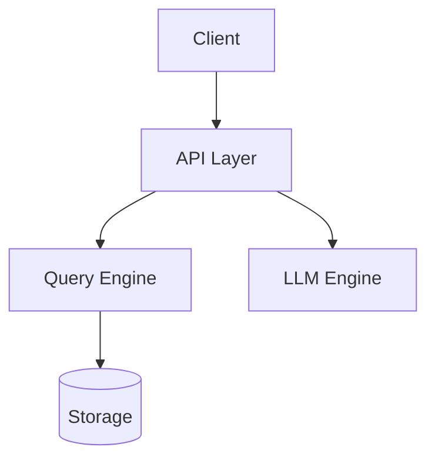

# ThemisDB Architecture Diagrams - WordPress Plugin

## 🎉 Update v1.1.0 - Themis Branding & Enhancements

**Major Update**: Comprehensive improvements for branding, accessibility, and performance!

### ✨ New Features

#### 🎨 Themis Brand Colors Integration
- Replaced standard Mermaid colors with official Themis brand colors
- Consistent styling across all diagram components
- Updated CSS variables for easy theming

#### 🌙 Dark Mode Support
- Automatic dark mode detection (system preference, WordPress theme, plugins)
- Separate dark mode stylesheet with optimized colors
- Smooth transitions between light and dark modes
- Cookie-based user preference support

#### ⚡ Performance Optimization
- Conditional script loading (Mermaid.js only loads when shortcode present)
- Lazy loading with IntersectionObserver API
- Upgraded to Mermaid.js ESM v10.6.1 for smaller bundle size
- Module preloading for faster initial load

#### ♿ WCAG 2.1 AA Accessibility
- Complete ARIA labels and roles for all interactive elements
- Screen reader support with descriptive text
- Keyboard navigation with visible focus indicators
- High contrast mode support
- Semantic HTML with proper figure/figcaption structure

#### 📱 Mobile Touch Optimization
- Responsive floating action buttons on mobile
- Touch targets sized to 44px minimum (iOS standard)
- Double-tap to zoom gestures
- Optimized layout for tablets and phones

#### 📥 Enhanced Export Features
- Export as SVG (existing)
- Export as PNG with canvas rendering
- Export Mermaid source code (.mmd files)
- Improved export naming with timestamps

#### ⚙️ Admin Panel Improvements
- New setting: Enable/disable dark mode
- New setting: Enable/disable lazy loading
- Default theme changed to "themis"

### 🔧 Technical Changes
- Updated plugin version to 1.1.0
- Added `themisdb_arch_get_color_scheme()` function
- New CSS file: `architecture-diagrams-dark.css`
- Enhanced JavaScript with modular color scheme detection
- Improved template accessibility

---

## 🔧 Update v1.0.1 - Bug Fix

**Issue Fixed**: Graph code was not being converted by Mermaid into graphics.

**Solution**: The plugin has been updated to use the correct Mermaid.js v10+ API:
- `mermaid.run()` now uses the `nodes` array parameter instead of `querySelector`
- Improved waiting logic for Mermaid library loading
- Added error handling for rendering failures
- Removes `data-processed` attribute for re-rendering

Diagrams should now display correctly! 🎉

---

A WordPress plugin for interactive visualization of ThemisDB system architecture. Display multi-model architecture, storage layer, LLM integration, and sharding/RAID configurations with Mermaid.js.

## 📋 Overview

This plugin follows the established **TCO Calculator** template pattern and provides comprehensive architecture visualization for ThemisDB with interactive Mermaid.js diagrams.

- **Shortcode-based Integration**: `[themisdb_architecture]`
- **Admin Settings Page**: Customize default values
- **Multiple Views**: High-level, Storage, LLM, Sharding/RAID
- **Interactive Components**: Clickable elements with details
- **Export Capabilities**: SVG and PNG export

## ✨ Features

### Architecture Views
- 🏗️ **High-Level Architecture**: Complete system overview
- �� **Storage Layer**: Multi-model storage details
- 🤖 **LLM Integration**: AI/ML architecture
- 🔄 **Sharding & RAID**: Distributed system configuration
- 🖥️ **Hardware Architecture**: CPU, GPU, Memory, Storage mapping to software components

### Comparison Diagrams (NEW!)
- 🆚 **Database Comparison**: ThemisDB vs PostgreSQL, MongoDB, Neo4j with feature matrix
- 🧠 **LLM Services Comparison**: Embedded LLM vs OpenAI, Anthropic, Ollama (cost, latency, privacy)
- ⚡ **Performance by Hardware**: CPU-only, Mid-Range GPU (RTX 4090), High-End GPU (A100) configurations
- 💰 **TCO Over Time**: 1, 3, and 5-year cost comparison (self-hosted vs cloud)
- ✅ **Feature Matrix**: Comprehensive feature support across all databases
- 🚀 **Deployment Options**: On-Premise, Cloud, Hybrid, and SaaS alternatives
- 🎯 **Use Case Recommendations**: Best database for each scenario (AI/ML, Graph, IoT, etc.)
- 🔄 **Migration Paths**: Clear migration routes from PostgreSQL, MongoDB, Neo4j, legacy systems

### Interactive Features (All Diagrams)
- 🎨 **Mermaid.js Diagrams**: Professional flowcharts
- 🖱️ **Clickable Components**: Show component details (interactive=true by default)
- 🔍 **Zoom Controls**: In, out, and reset
- 📺 **Fullscreen Mode**: Immersive viewing
- 📊 **Multiple Themes**: Neutral, default, dark, forest

### WordPress Integration
- 📝 **Shortcode**: Easy embedding via `[themisdb_architecture]`
- ⚙️ **Admin Panel**: Settings → Architecture Diagrams
- 🎨 **Theme-compatible**: Works with any WordPress theme
- �� **Responsive**: Optimized for all screen sizes

### Export & Sharing
- 📥 **Export Functions**: SVG and PNG download
- 🖨️ **Print Support**: Optimized print layout

## 🚀 Installation

### Manual Installation

1. **Download the Plugin**
   ```bash
   cd /path/to/wordpress/wp-content/plugins/
   cp -r /path/to/ThemisDB/tools/architecture-diagrams-wordpress ./themisdb-architecture-diagrams
   ```

2. **Activate the Plugin**
   - Go to WordPress Admin → Plugins
   - Find "ThemisDB Architecture Diagrams"
   - Click "Activate"

3. **Configure Settings**
   - Go to Settings → Architecture Diagrams
   - Choose default view and theme

## 📖 Usage

### Basic Shortcode

```php
[themisdb_architecture]
```

### Shortcode with Parameters

#### Specific View
```php
<!-- Architecture Views -->
[themisdb_architecture view="high_level"]
[themisdb_architecture view="storage_layer"]
[themisdb_architecture view="llm_integration"]
[themisdb_architecture view="sharding_raid"]
[themisdb_architecture view="hardware_architecture"]

<!-- Comparison Views -->
[themisdb_architecture view="database_comparison"]
[themisdb_architecture view="llm_comparison"]
[themisdb_architecture view="performance_comparison"]
```

#### Custom Theme
```php
[themisdb_architecture theme="neutral"]
[themisdb_architecture theme="dark"]
[themisdb_architecture theme="forest"]
```

#### Without Controls
```php
[themisdb_architecture show_controls="false"]
```

#### Combined Parameters
```php
[themisdb_architecture 
    view="llm_integration" 
    theme="neutral" 
    interactive="true"]
```

## 🛠️ Technical Details

### File Structure

```
themisdb-architecture-diagrams/
├── themisdb-architecture-diagrams.php  # Main plugin file
├── assets/
│   ├── css/
│   │   └── architecture-diagrams.css   # Styling
│   └── js/
│       └── architecture-diagrams.js    # JavaScript with Mermaid.js
├── templates/
│   ├── diagram.php                     # Main template
│   └── admin-settings.php              # Admin settings
├── diagrams/                           # (optional) Diagram definitions
├── README.md
└── LICENSE
```

### Technologies

- **PHP**: WordPress plugin development (7.4+)
- **JavaScript**: ES5+ with jQuery
- **Mermaid.js**: Version 10 for diagrams
- **CSS3**: Modern, responsive styling
- **WordPress API**: Settings API, Shortcode API, AJAX

### Architecture Views

1. **High-Level**: Shows client layer, API layer, query engine, storage, and LLM integration
2. **Storage Layer**: Displays RocksDB-based multi-model storage with indexes
3. **LLM Integration**: Illustrates llama.cpp integration and model management
4. **Sharding & RAID**: Demonstrates distributed architecture with replication
5. **Hardware Architecture**: Maps software components to hardware (CPU, GPU, RAM, Storage, Network)

### Comparison Views (NEW!)

1. **Database Comparison**: Comprehensive comparison showing:
   - **ThemisDB** vs **PostgreSQL** vs **MongoDB** vs **Neo4j**
   - Multi-model support (ThemisDB supports all models natively)
   - LLM capabilities (only ThemisDB has embedded LLM)
   - GPU acceleration (only ThemisDB has native GPU support)
   - Protocol compatibility (ThemisDB supports all major protocols)

2. **LLM Services Comparison**: Side-by-side comparison of:
   - **ThemisDB Embedded LLM** (llama.cpp): Zero latency, zero cost, complete privacy
   - **OpenAI API**: Cloud-based, pay-per-token, data sent to cloud
   - **Anthropic Claude**: Cloud-based, pay-per-token, data sent to cloud
   - **Ollama**: Local but separate service, not database-integrated
   - Key metrics: Latency, cost, privacy, integration

3. **Performance by Hardware**: Shows real-world performance across different configurations:
   - **CPU Only** (Intel Xeon 32-Core): Baseline performance, $500/month
   - **CPU + Mid-Range GPU** (RTX 4090): 5-25x faster, $2,000/month
   - **CPU + High-End GPU** (A100 80GB): 20-40x faster, $10,000/month
   - **Cloud Alternative**: Variable cost ($5K-50K/month), network latency, no privacy
   - Includes vector search QPS and LLM tokens/sec metrics


## 🎨 Mermaid.js Integration

The plugin uses Mermaid.js to create interactive, text-based diagrams:

### Example Diagram Code


## 🔒 Security

- **Nonce Verification**: All AJAX requests verified
- **Capability Checks**: Admin functions require proper permissions
- **Input Sanitization**: All inputs sanitized
- **Output Escaping**: All outputs properly escaped

## 🎮 Controls

- **View Selector**: Switch between different architecture views
- **Zoom In/Out**: Adjust diagram size
- **Fullscreen**: Toggle fullscreen mode
- **Export**: Download as SVG or PNG
- **Print**: Print-optimized layout

## 📄 License

MIT License - See LICENSE file

## 🔗 Links

- **GitHub**: [makr-code/wordpressPlugins](https://github.com/makr-code/wordpressPlugins)
- **Plugin Path**: `/tools/architecture-diagrams-wordpress/`

## 🗺️ Roadmap

- [ ] Custom diagram uploads
- [ ] More architecture views
- [ ] Animation support
- [ ] Diagram version history
- [ ] Collaborative editing

## 📊 Version History

### Version 1.0.0 (Initial Release)
- Interactive architecture diagrams
- Four distinct views
- Mermaid.js integration
- Zoom and fullscreen controls
- SVG/PNG export
- WordPress admin integration
- Responsive design

---

**Powered by [ThemisDB](https://github.com/makr-code/wordpressPlugins)** - Part of Phase 2 Implementation
